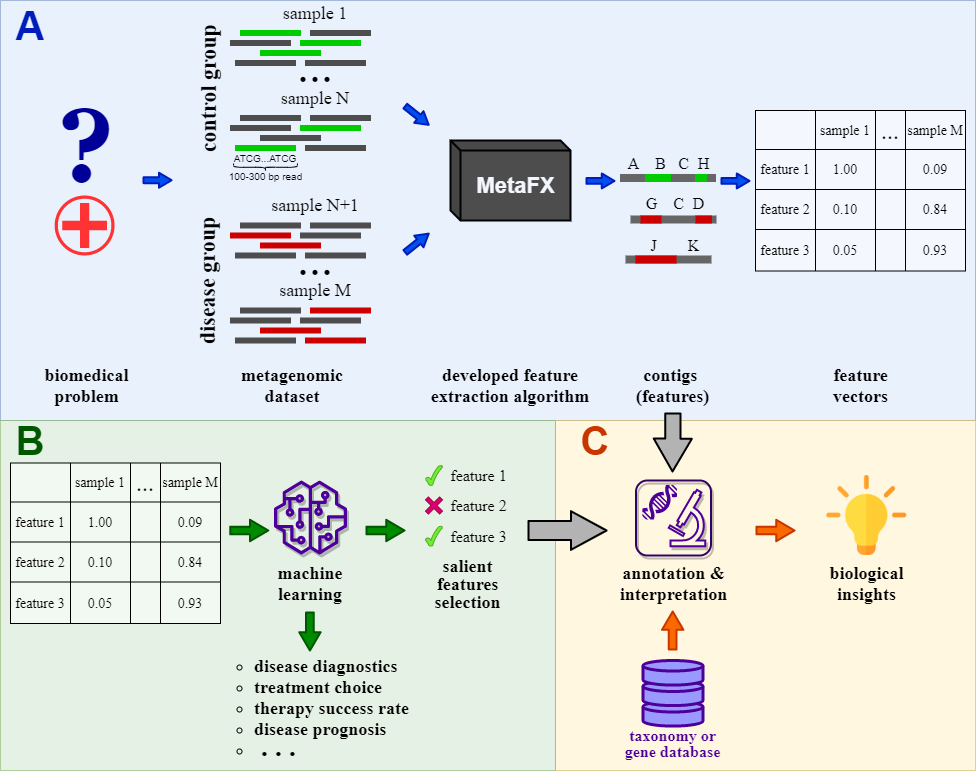

# MetaFX

**MetaFX** (METAgenomic Feature eXtraction) is a toolkit for feature construction and classification of metagenomic samples.

The idea behind **MetaFX** is to introduce feature extraction algorithm specific for metagenomics short reads data. It is capable of processing hundreds of samples 1-10 Gb each. The distinct property of suggest approach is the construction of meaningful features, which can not only be used to train classification model, but also can be further annotated and biologically interpreted.

**MetaFX** documentation is available on the GitHub [wiki page](https://github.com/ivartb/metafx/wiki). 
Here is a short version of it.

## Table of contents
<!--ts-->
  * [Installation](#installation)
  * [Running instructions](#running-instructions)
  * [Contact](#contact)
  * [License](#license)
  * [See also](#see-also)
<!--te-->

## Installation

#### Requirements:
* JRE 1.8 or higher
* python3
* python libraries for classification problem:
    * [NumPy](https://numpy.org/)
    * [Pandas](https://pandas.pydata.org/)
    * [Matplotlib](https://matplotlib.org/)
    * [scikit-learn](https://scikit-learn.org/stable/index.html)
    * [PyTorch](https://pytorch.org/)

Should you choose to build contigs via third-party [metaSPAdes](https://cab.spbu.ru/software/meta-spades/) software, please follow their [installation instructions](https://github.com/ablab/spades#sec2).

To run MetaFX you need scripts from the `bin/` folder. The main script to run is `metafx.sh`.

Scripts have been tested under *Ubuntu 18.04 LTS*, but should generally work on Linux/MacOS.

## Running instructions

## Contact

Please report any problems directly to the GitHub [issue tracker](https://github.com/ivartb/metafx/issues).

Also, you can send your feedback to [abivanov@itmo.ru](mailto:abivanov@itmo.ru).

Authors:
* **Software:** *Artem Ivanov* ([ITMO University](http://en.itmo.ru/en/))
* **Supervisor:** [*Vladimir Ulyantsev*](https://ulyantsev.com) ([ITMO University](http://en.itmo.ru/en/))

## License

The MIT License (MIT)

## See also

* [MetaFast](https://github.com/ctlab/metafast/) – a toolkit for comparison of metagenomic samples.
* [MetaCherchant](https://github.com/ctlab/metacherchant) – a tool for analysing genomic environment within a metagenome.
* [RECAST](https://github.com/ctlab/recast) – a tool for sorting reads per their origin in metagenomic time series.