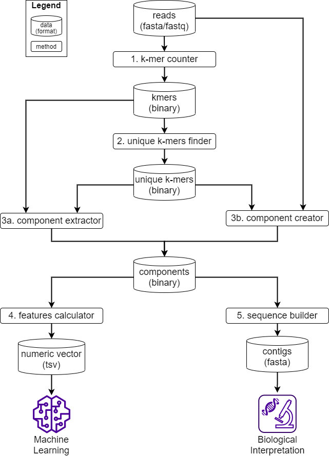

# Wiki

Welcome to the **MetaFX** wiki!

Metagenomic feature extraction and classification toolkit, version 0.1.0.

## Table of contents
<!--ts-->
  * [Description](#description)
  * [Installation](#installation)
  * [Running instructions](#running-instructions)
      * [Input files](#input-files)
      * [Output files](#output-files)
      * [Options and Parameters](#options-and-parameters)
  * [Step-by-step example](#step-by-step-example)
      * [Hardware configuration](#hardware-configuration)
      * [Example dataset](#example-dataset)
      * [Step-by-step pipeline](#step-by-step-pipeline)
  * [Contact](#contact)
  * [License](#license)
  * [See also](#see-also)
<!--te-->

## Description

The idea behind **MetaFX** is to introduce feature extraction algorithm specific for metagenomics short reads data. It is capable of processing hundreds of samples 1-10 Gb each. The distinct property of suggest approach is the construction of meaningful features, which can not only be used to train classification model, but also can be further annotated and biologically interpreted.


## Installation

#### Requirements:
* JRE 1.8 or higher
* python3
* python libraries for classification problem:
    * [NumPy](https://numpy.org/)
    * [Pandas](https://pandas.pydata.org/)
    * [Matplotlib](https://matplotlib.org/)
    * [scikit-learn](https://scikit-learn.org/stable/index.html)
    * [PyTorch](https://pytorch.org/)

Should you choose to build contigs via third-party [SPAdes](https://cab.spbu.ru/software/spades/) software, please follow their [installation instructions](https://github.com/ablab/spades#sec2) (not recommended for first-time use).

To run MetaFX you need scripts from the `bin/` folder. The main script to run is `metafx.sh`.

Scripts have been tested under *Ubuntu 18.04 LTS*, but should generally work on Linux/MacOS.

## Running instructions

### Input files

### Output files

### Options and Parameters

## Step-by-step example

#### Hardware configuration

The pipeline was executed on cluster node with *Intel Xeon Gold 6242* CPU (frequency 2.80GH). We used 32 threads and 128GB RAM.

Running time for each step are approximate and given for rough waiting time estimation. The most time-consuming steps 1 and 2 are well parallelized and results could be improved by adding more threads.
 
#### Example dataset

Initially, the presented feature extraction method was developed for [Metagenomics Diagnosis for Inflammatory bowel disease Challenge (MEDIC)](https://www.intervals.science/resources/sbv-improver/medic). Here we use a subset of metagenomic dataset from IBD patients for example purposes.

The analysed data was collected as a part of The integrative Human Microbiome Project and is stored in [The Inflammatory Bowel Disease Multi'omics Database](https://www.ibdmdb.org/). We took samples from [Schirmer et al. 2018](https://doi.org/10.1038/s41564-017-0089-z) article and further filtered them resulting in 54 samples. They are distributed into three categories: 23 *CD* – Crohn's Disease , 17 *UC* – ulcerative colitis UC, 14 *nonIBD* – control samples.

Metadata table for example dataset is in `data/Class_labels.txt`. The samples can be found and downloaded [by this link](https://ibdmdb.org/tunnel/public/HMP2/WGS/1818/rawfiles).

#### Step-by-step pipeline



##### Step 0. Download data *(~8h)*

Download 54 samples from IBD dataset and unpack them into `data/` folder.
```
cd data/
for i in `tail -n +2 Class_labels.txt | cut -f2` ; do
  wget https://ibdmdb.org/tunnel/static/HMP2/WGS/1818/${i}.tar
  tar -xf ${i}.tar
done
cd ../
```
As a result in `data/` folder there will be 54 samples with paired-end reads in format `<sample>_[R1|R2].fastq.gz`.

##### Step 1. Extract k-mers for each sample *(1h23min)*

Split input reads into k-mers for each sample independently. We set k-mer length `-k 31` and filtered out all k-mers found less than 5 times per sample with `-p 4`.

```
bin/metafast.sh -t kmer-counter-many -p 32 -m 128G -k 31 -b 4 -i data/*.fastq.gz -w kmer-counter-many
```
As a result in `kmer-counter-many/kmers/` folder there will be 54 files storing kmers in binary format.

##### Step 2. Select unique k-mers for each group *(31min)*

Select unique k-mers present in at least given number *G* of samples of one category and absent in all samples of other categories. By default *G=1* and can be user-defined to iterate in range [`--min-samples`; `--max-samples`].

Sample names for each category are in files `data/[cd|uc|nonibd]_filelist.txt` and we use `sed` command to get path to respective k-mers files.

First, we submit CD files as input and UC & nonIBD files as other categories (`--filter-kmers`) to obtain unique k-mers for CD group. We let *G* iterate from 1 to 10.

```
bin/metafast.sh -t unique-kmers-multi -p 32 -m 128G -k 31 -w unique_kmers_cd \
  --min-samples 1 --max-samples 10 \
  -i `sed -e 's/^/kmer-counter-many\/kmers\//' data/cd_filelist.txt | sed -e 's/$/.kmers.bin/'` \
  --filter-kmers `sed -e 's/^/kmer-counter-many\/kmers\//' data/uc_filelist.txt data/nonibd_filelist.txt | sed -e 's/$/.kmers.bin/'`
```
The resulting unique k-mers are in file `unique_kmers_cd/kmers/filtered_G.kmers.bin`.

Likewise, we repeat the operation twice to obtain unique k-mers for UC and nonIBD groups.

```
bin/metafast.sh -t unique-kmers-multi -p 32 -m 128G -k 31 -w unique_kmers_uc \
  --min-samples 1 --max-samples 10 \
  -i `sed -e 's/^/kmer-counter-many\/kmers\//' data/uc_filelist.txt | sed -e 's/$/.kmers.bin/'` \
  --filter-kmers `sed -e 's/^/kmer-counter-many\/kmers\//' data/cd_filelist.txt data/nonibd_filelist.txt | sed -e 's/$/.kmers.bin/'`
        
bin/metafast.sh -t unique-kmers-multi -p 32 -m 128G -k 31 -w unique_kmers_nonibd \
  --min-samples 1 --max-samples 10 \
  -i `sed -e 's/^/kmer-counter-many\/kmers\//' data/nonibd_filelist.txt | sed -e 's/$/.kmers.bin/'` \
  --filter-kmers `sed -e 's/^/kmer-counter-many\/kmers\//' data/cd_filelist.txt data/uc_filelist.txt | sed -e 's/$/.kmers.bin/'`
```

##### Checkpoint

Now we should have three folders, containing files with unique k-mers with various thresholds for each of three groups: `unique_kmers_cd/kmers/`, `unique_kmers_uc/kmers/`, and `unique_kmers_nonibd/kmers/`. To choose the optimal threshold value for each category, we are to analyse the number of selected unique k-mers. Based on the information from the log files, we can construct the following table:

<div align="center">

|# of unique k-mers|CD         |UC         |nonIBD      |
|:----------------:|----------:|----------:|-----------:|
|*G=1*             |290 305 004|173 368 403|194 372 801 |
|*G=2*             |29 361 767 |8 088 872  |17 592 216  |
|*G=3*             |5 950 400  |638 053    |2 343 764   |
|*G=4*             |1 738 998  |<span style="color:green">59 181</span>     |618 736     |
|*G=5*             |459 717    |6 579      |206 860     |
|*G=6*             |<span style="color:green">86 875</span>     |488        |<span style="color:green">63 643</span>      |
|*G=7*             |14 892     |20         |16 635      |
|*G=8*             |2 056      |0          |2 977       |
|*G=9*             |260        |0          |200         |
|*G=10*            |46         |0          |0           |
</div>

With the final goal of constructing approximately equal number of features for each group, the optimal values are *G=6* for CD and nonIBD categories and *G=4* for UC category. With these values we are ready for step 3.

##### Step 3. Build components from de Bruijn graph

Having selected unique k-mers for groups of samples, we are ready to construct metagenomic features. There are two approaches, both based on de Bruijn graph. One of them utilizes MetaFast routine for extracting local environment around given k-mers. Another is based on SPAdes assembly of reads, containing selected k-mers.

SPAdes approach takes significantly more time, especially on low- and medium-sized datasets. For large datasets, however, it might give a bit better results for classification models. Anyway, it is not recommended to try *step 3b* unless you get and analyze results using *step 3a*.

##### Step 3a. Extract components via MetaFast  *(1min)*

Construct de Bruijn graph from k-mers from all samples for a given category, and perform a local walk in this graph, starting from unique k-mers (`--pivot`) for the same category. 

```
bin/metafast.sh -t component-extractor -p 32 -m 128G -k 31 -w components_cd \
  --pivot unique_kmers_cd/kmers/filtered_6.kmers.bin \
  -i `sed -e 's/^/kmer-counter-many\/kmers\//' data/cd_filelist.txt | sed -e 's/$/.kmers.bin/'`
```
The resulting specific components for CD group are in file `components_cd/components.bin`.

Likewise, we repeat the operation twice to obtain specific components for UC and nonIBD groups.

```
bin/metafast.sh -t component-extractor -p 32 -m 128G -k 31 -w components_uc \
  --pivot unique_kmers_uc/kmers/filtered_4.kmers.bin \
  -i `sed -e 's/^/kmer-counter-many\/kmers\//' data/uc_filelist.txt | sed -e 's/$/.kmers.bin/'`

bin/metafast.sh -t component-extractor -p 32 -m 128G -k 31 -w components_nonibd \
  --pivot unique_kmers_nonibd/kmers/filtered_6.kmers.bin \
  -i `sed -e 's/^/kmer-counter-many\/kmers\//' data/nonibd_filelist.txt | sed -e 's/$/.kmers.bin/'`
```
After this step, we have *7 621* CD components, *5 557* UC components, and  *4 794* nonIBD components.

##### Step 3b. Extract components via SPAdes *(3h32min)*

To use SPAdes for k-mer extraction, we need to perform several steps:

1. Translate unique k-mers from binary format into plane text and save them into files `unique_kmers_[cd|uc|nonibd].txt`.

```
bin/metafast.sh -t view -m 128G -p 32 -k 31 -w unique_kmers_cd_txt -kf unique_kmers_cd/kmers/filtered_6.kmers.bin -o unique_kmers_cd.txt
bin/metafast.sh -t view -m 128G -p 32 -k 31 -w unique_kmers_uc_txt -kf unique_kmers_uc/kmers/filtered_4.kmers.bin -o unique_kmers_uc.txt
bin/metafast.sh -t view -m 128G -p 32 -k 31 -w unique_kmers_nonibd_txt -kf unique_kmers_nonibd/kmers/filtered_6.kmers.bin -o unique_kmers_nonibd.txt
```
2. For each category select from all samples only those reads, which contain unique k-mers. Reads for each combination of sample and category are in `reads_with_kmers/` folder.
```
mkdir reads_with_kmers
python bin/reads_filter.py -k 31 -p 32 -w reads_with_kmers --reads data/*.fastq.gz --kmers unique_kmers_cd.txt unique_kmers_uc.txt unique_kmers_nonibd.txt
```
3. Join reads from all sample for each category into one file.
```
cat reads_with_kmers/*_class_0.fasta > reads_with_kmers/reads_cd.fasta
cat reads_with_kmers/*_class_1.fasta > reads_with_kmers/reads_uc.fasta
cat reads_with_kmers/*_class_2.fasta > reads_with_kmers/reads_nonibd.fasta
```
4. Assemble contigs from reads for each category independently. Resulting contigs are in files `spades_contigs_[cd|uc|nonibd]/contigs.fasta`.
```
<path_to_spades>/spades.py -t 32 -m 128G -s reads_with_kmers/reads_cd.fasta --only-assembler -o spades_contigs_cd
<path_to_spades>/spades.py -t 32 -m 128G -s reads_with_kmers/reads_uc.fasta --only-assembler -o spades_contigs_uc
<path_to_spades>/spades.py -t 32 -m 128G -s reads_with_kmers/reads_nonibd.fasta --only-assembler -o spades_contigs_nonibd
```
**NB!** If you have done this step, you do not need to run *step 5*. You alerady have contigs in *fasta* format to analyze.

1. Transform *fasta* contigs into binary format for feature calculation.
```
bin/metafast.sh -t seq2comp -m 128G -p 32 -k 31 -w components_cd -i spades_contigs_cd/contigs.fasta
bin/metafast.sh -t seq2comp -m 128G -p 32 -k 31 -w components_uc -i spades_contigs_uc/contigs.fasta
bin/metafast.sh -t seq2comp -m 128G -p 32 -k 31 -w components_nonibd -i spades_contigs_nonibd/contigs.fasta
```
That's it! Components for each category in binary format are in files `components_[cd|uc|nonibd]/components.bin` and we are ready for *step 4*.


##### Step 4. Calculate feature values *(2min)*

After step 3 we obtain components for each of categories, that will play the role of features in subsequent analysis. In order to use the features in machine learning algorithms, we need to map each feature to numerical value for each sample. We take selected components for a given category and calculate the coverage of each component by k-mers from each sample independently.

```
bin/metafast.sh -t features-calculator -p 32 -m 128G -k 31 -w features_cd -cm components_cd/components.bin \
        -ka kmer-counter-many/kmers/*.kmers.bin \
        --selected unique_kmers_cd/kmers/filtered_6.kmers.bin
```
As a result, CD feature values (breadth coverage) for each sample are stored in files `features_cd/vectors/<sample>.breadth`.

Likewise, we repeat the operation twice to obtain feature values for UC and nonIBD groups.

```
bin/metafast.sh -t features-calculator -p 32 -m 128G -k 31 -w features_uc -cm components_uc/components.bin \
        -ka kmer-counter-many/kmers/*.kmers.bin \
        --selected unique_kmers_uc/kmers/filtered_4.kmers.bin

bin/metafast.sh -t features-calculator -p 32 -m 128G -k 31 -w features_nonibd -cm components_nonibd/components.bin \
        -ka kmer-counter-many/kmers/*.kmers.bin \
        --selected unique_kmers_nonibd/kmers/filtered_6.kmers.bin
```


##### **Congrats!** 
Now for each sample we have three files with numerical features for CD, UC, and nonIBD categories. From this point we are ready to use machine learning for classification task. 

You can use your favourite algorithm for this purpose. If you are unsure what to do, there are two Jupyter Notebook examples with detailed description of training steps and classification results:

* [Random Forest example](RandomForest.ipynb)
* [Neural Network example](NeuralNetwork.ipynb)


##### Step 5. Transform features into contigs *(1min)*

It might be relevant to analyse the extracted features from biological point of view. For taxonomic and functional annotation, we need nucleotide sequences corresponding to each component. 

```
bin/metafast.sh -t comp2seq -p 32 -m 128G -k 31 -w contigs_cd -cf components_cd/components.bin
```
The resulting CD contigs are in `contigs_cd/seq-builder-many/sequences/component.seq.fasta.`

Likewise, we repeat the operation twice to obtain contigs for UC and nonIBD groups.

```
bin/metafast.sh -t comp2seq -p 32 -m 128G -k 31 -w contigs_uc -cf components_uc/components.bin
bin/metafast.sh -t comp2seq -p 32 -m 128G -k 31 -w contigs_nonibd -cf components_nonibd/components.bin
```

**NB!** If you want to analyse the contigs for a specific component, and not all components, `--split` flag might help. Be careful, it saves contigs for each component in a separate file, so there might be a lot of files afterwards.

## Contact

Please report any problems directly to the GitHub [issue tracker](https://github.com/ivartb/metafx/issues).

Also, you can send your feedback to [abivanov@itmo.ru](mailto:abivanov@itmo.ru).

Authors:
* **Software:** *Artem Ivanov* ([ITMO University](http://en.itmo.ru/en/))
* **Supervisor:** [*Vladimir Ulyantsev*](https://ulyantsev.com) ([ITMO University](http://en.itmo.ru/en/))


## License

The MIT License (MIT)

## See also

* [MetaFast](https://github.com/ctlab/metafast/) – a toolkit for comparison of metagenomic samples.
* [MetaCherchant](https://github.com/ctlab/metacherchant) – a tool for analysing genomic environment within a metagenome.
* [RECAST](https://github.com/ctlab/recast) – a tool for sorting reads per their origin in metagenomic time series.